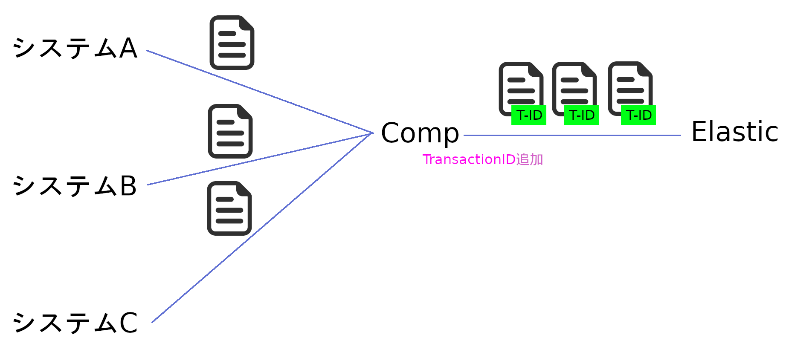
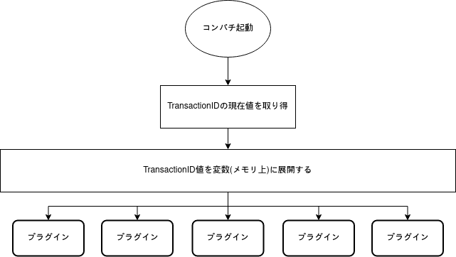

# 自動ID割り当て検討

## 目的

データ登録先のElasticはTransactionIdインクリメント機能がないため、TransactionIdの割り当てはコンパチで行う必要がある。

## 仕組み

コンパチは受け取ったjsonデータをElastic対応可の形に変換し、TransactionIDを追加、そのデータの登録を行う

コンパチ起動時にElasticから現在TransactionId値を取り得し、その値を共有変数(メモリ上)に展開する。各プラグインが共有されたTransactionIdを参照、変更する。
TransactionIdをメモリに展開することにより、コンパチにデータベースを持たすことの必要がなく、高速アクセスとこができると考える。