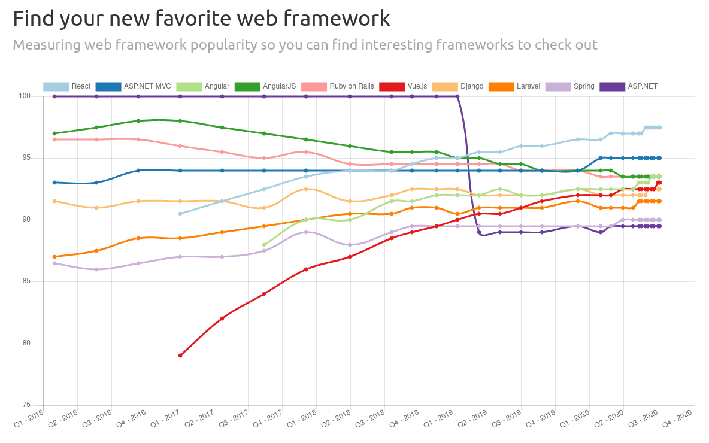

## 1. Go言語選択理由

- クロスプラットフォーム
- パッケージ管理
- Web系開発や
- 標準ライブラリが整備されている
  - Jsonをオブジェクト化

<pre>      type TestJsonObj struct {
        Id int `json:id`
        Content interface `json:content`
      }
      sampleJson := `{"id": "1","content": "{"data1":10,"data2":20}"}`
      var testJsonObj TestJsonObj	
      json.Unmarshal([]byte(sampleJson), &testJsonObj)
      fmt.Printf("Id: %s, Content: %s", testJsonObj.Id, testJsonObj.Content)
</pre>
- 処理速度

## 2. ベンチマーク

#### システムスペック

|    |    |
|----|:---|
| Processor | 2vCPU Intel(R) Xeon(R) CPU E3-1240 v6 @ 3.70GHz |
| RAM | 1.8 GB |
| OS | centos |
| [Bombardier](https://github.com/codesenberg/bombardier) | v1.2.4 |
| [Go](https://golang.org) | go1.14.4 |
| [.Net Core](https://dotnet.microsoft.com/) | 3.1.301 |
| [Node.js](https://nodejs.org/) | v10.21.0 |

📖 Fires 1000000 requests, receives a static message as response.

| Name | Language | Reqs/sec | Latency | Throughput | Time To Complete |
|------|:---------|:---------|:--------|:-----------|:-----------------|
| [Martini](https://github.com/go-martini/martini) | Go |55952 |2.25ms |9.97MB |17.98s |
| [Echo](https://github.com/labstack/echo) | Go |55443 |2.25ms |9.95MB |18.03s |
| [Chi](https://github.com/pressly/chi) | Go |55402 |2.25ms |9.94MB |18.04s |
| [Gin](https://github.com/gin-gonic/gin) | Go |54888 |2.27ms |9.85MB |18.21s |
| [Iris](https://github.com/kataras/iris) | Go |54783 |2.28ms |9.84MB |18.23s |
| [Buffalo](https://github.com/gobuffalo/buffalo) | Go |54636 |2.28ms |9.81MB |18.28s |
| [Kestrel](https://github.com/dotnet/aspnetcore) | C# |53492 |2.33ms |9.59MB |18.69s |
| [Express](https://github.com/expressjs/express) | Javascript |27593 |4.54ms |4.94MB |36.30s |
| [Koa](https://github.com/koajs/koa) | Javascript |27489 |4.54ms |4.93MB |36.35s |

📖 Fires 1000000 requests, receives a static message as response.

| Name | Language | Reqs/sec | Latency | Throughput | Time To Complete |
|------|:---------|:---------|:--------|:-----------|:-----------------|
| [Chi](https://github.com/pressly/chi) | Go |55789 |2.23ms |10.03MB |17.88s |
| [Martini](https://github.com/go-martini/martini) | Go |55765 |2.24ms |10.02MB |17.90s |
| [Echo](https://github.com/labstack/echo) | Go |55626 |2.24ms |9.99MB |17.95s |
| [Gin](https://github.com/gin-gonic/gin) | Go |55452 |2.25ms |9.94MB |18.03s |
| [Iris](https://github.com/kataras/iris) | Go |54835 |2.28ms |9.83MB |18.23s |
| [Buffalo](https://github.com/gobuffalo/buffalo) | Go |54520 |2.29ms |9.79MB |18.32s |
| [Kestrel](https://github.com/dotnet/aspnetcore) | C# |53590 |2.33ms |9.61MB |18.66s |
| [Express](https://github.com/expressjs/express) | Javascript |27563 |4.54ms |4.94MB |36.31s |
| [Koa](https://github.com/koajs/koa) | Javascript |26985 |4.64ms |4.83MB |37.13s |

📖 Fires 1000000 requests, receives a static message as response.

| Name | Language | Reqs/sec | Latency | Throughput | Time To Complete |
|------|:---------|:---------|:--------|:-----------|:-----------------|
| [Chi](https://github.com/pressly/chi) | Go |57973 |2.15ms |10.39MB |17.25s |
| [Martini](https://github.com/go-martini/martini) | Go |57854 |2.16ms |10.38MB |17.28s |
| [Echo](https://github.com/labstack/echo) | Go |57733 |2.16ms |10.36MB |17.30s |
| [Iris](https://github.com/kataras/iris) | Go |57107 |2.19ms |10.24MB |17.51s |
| [Gin](https://github.com/gin-gonic/gin) | Go |56879 |2.19ms |10.21MB |17.56s |
| [Buffalo](https://github.com/gobuffalo/buffalo) | Go |56665 |2.20ms |10.17MB |17.63s |
| [Kestrel](https://github.com/dotnet/aspnetcore) | C# |55971 |2.23ms |10.03MB |17.87s |
| [Koa](https://github.com/koajs/koa) | Javascript |28810 |4.34ms |5.16MB |34.74s |
| [Express](https://github.com/expressjs/express) | Javascript |27406 |4.56ms |4.91MB |36.50s |

📖 Fires 1000000 requests, receives a static message as response.

| Name | Language | Reqs/sec | Latency | Throughput | Time To Complete |
|------|:---------|:---------|:--------|:-----------|:-----------------|
| [Chi](https://github.com/pressly/chi) | Go |58488 |2.13ms |10.49MB |17.10s |
| [Echo](https://github.com/labstack/echo) | Go |58427 |2.15ms |10.43MB |17.19s |
| [Iris](https://github.com/kataras/iris) | Go |58064 |2.15ms |10.42MB |17.21s |
| [Buffalo](https://github.com/gobuffalo/buffalo) | Go |57991 |2.15ms |10.41MB |17.23s |
| [Martini](https://github.com/go-martini/martini) | Go |57971 |2.15ms |10.41MB |17.22s |
| [Gin](https://github.com/gin-gonic/gin) | Go |57736 |2.16ms |10.36MB |17.30s |
| [Kestrel](https://github.com/dotnet/aspnetcore) | C# |55902 |2.23ms |10.03MB |17.88s |
| [Koa](https://github.com/koajs/koa) | Javascript |28973 |4.32ms |5.19MB |34.56s |
| [Express](https://github.com/expressjs/express) | Javascript |28439 |4.40ms |5.09MB |35.25s |

📖 Fires 1000000 requests, receives a static message as response.

| Name | Language | Reqs/sec | Latency | Throughput | Time To Complete |
|------|:---------|:---------|:--------|:-----------|:-----------------|
| [Chi](https://github.com/pressly/chi) | Go |57905 |2.16ms |10.36MB |17.31s |
| [Martini](https://github.com/go-martini/martini) | Go |57900 |2.16ms |10.39MB |17.26s |
| [Echo](https://github.com/labstack/echo) | Go |57693 |2.16ms |10.35MB |17.32s |
| [Iris](https://github.com/kataras/iris) | Go |57151 |2.18ms |10.26MB |17.48s |
| [Gin](https://github.com/gin-gonic/gin) | Go |56759 |2.20ms |10.18MB |17.61s |
| [Buffalo](https://github.com/gobuffalo/buffalo) | Go |56647 |2.20ms |10.18MB |17.62s |
| [Kestrel](https://github.com/dotnet/aspnetcore) | C# |55902 |2.23ms |10.03MB |17.88s |
| [Express](https://github.com/expressjs/express) | Javascript |28821 |4.34ms |5.16MB |34.77s |
| [Koa](https://github.com/koajs/koa) | Javascript |28079 |4.45ms |5.03MB |35.64s |

## 3.　言語トレンド

参考資料: https://hotframeworks.com/

## 4. ライセンス

### Go lang

<pre>
Copyright (c) 2009 The Go Authors. All rights reserved.

Redistribution and use in source and binary forms, with or without

modification, are permitted provided that the following conditions are

met:

   * Redistributions of source code must retain the above copyright

notice, this list of conditions and the following disclaimer.

   * Redistributions in binary form must reproduce the above

copyright notice, this list of conditions and the following disclaimer

in the documentation and/or other materials provided with the

distribution.

   * Neither the name of Google Inc. nor the names of its

contributors may be used to endorse or promote products derived from

this software without specific prior written permission.

THIS SOFTWARE IS PROVIDED BY THE COPYRIGHT HOLDERS AND CONTRIBUTORS

"AS IS" AND ANY EXPRESS OR IMPLIED WARRANTIES, INCLUDING, BUT NOT

LIMITED TO, THE IMPLIED WARRANTIES OF MERCHANTABILITY AND FITNESS FOR

A PARTICULAR PURPOSE ARE DISCLAIMED. IN NO EVENT SHALL THE COPYRIGHT

OWNER OR CONTRIBUTORS BE LIABLE FOR ANY DIRECT, INDIRECT, INCIDENTAL,

SPECIAL, EXEMPLARY, OR CONSEQUENTIAL DAMAGES (INCLUDING, BUT NOT

LIMITED TO, PROCUREMENT OF SUBSTITUTE GOODS OR SERVICES; LOSS OF USE,

DATA, OR PROFITS; OR BUSINESS INTERRUPTION) HOWEVER CAUSED AND ON ANY

THEORY OF LIABILITY, WHETHER IN CONTRACT, STRICT LIABILITY, OR TORT

(INCLUDING NEGLIGENCE OR OTHERWISE) ARISING IN ANY WAY OUT OF THE USE

OF THIS SOFTWARE, EVEN IF ADVISED OF THE POSSIBILITY OF SUCH DAMAGE.
</pre>

### Gin web framework

<pre>
The MIT License (MIT)

Copyright (c) 2014 Manuel Martínez-Almeida

Permission is hereby granted, free of charge, to any person obtaining a copy
of this software and associated documentation files (the "Software"), to deal
in the Software without restriction, including without limitation the rights
to use, copy, modify, merge, publish, distribute, sublicense, and/or sell
copies of the Software, and to permit persons to whom the Software is
furnished to do so, subject to the following conditions:

The above copyright notice and this permission notice shall be included in
all copies or substantial portions of the Software.

THE SOFTWARE IS PROVIDED "AS IS", WITHOUT WARRANTY OF ANY KIND, EXPRESS OR
IMPLIED, INCLUDING BUT NOT LIMITED TO THE WARRANTIES OF MERCHANTABILITY,
FITNESS FOR A PARTICULAR PURPOSE AND NONINFRINGEMENT. IN NO EVENT SHALL THE
AUTHORS OR COPYRIGHT HOLDERS BE LIABLE FOR ANY CLAIM, DAMAGES OR OTHER
LIABILITY, WHETHER IN AN ACTION OF CONTRACT, TORT OR OTHERWISE, ARISING FROM,
OUT OF OR IN CONNECTION WITH THE SOFTWARE OR THE USE OR OTHER DEALINGS IN
THE SOFTWARE.
</pre>